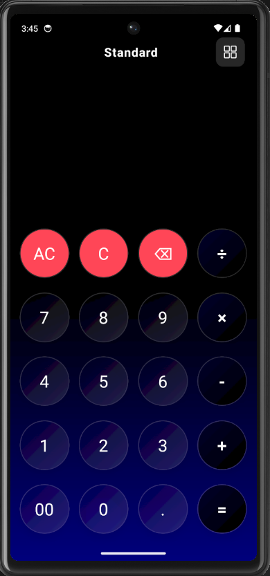
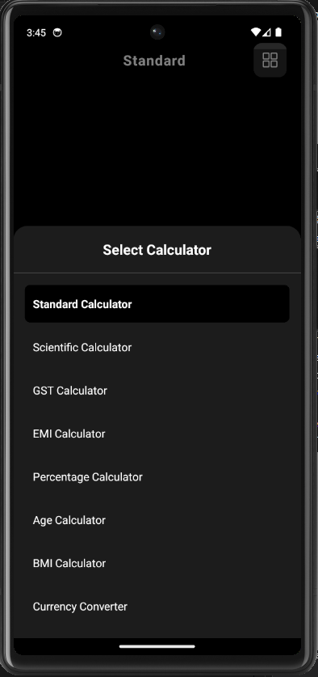
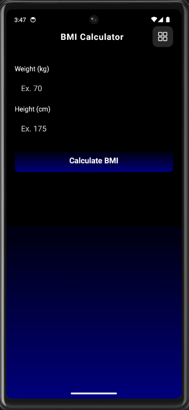
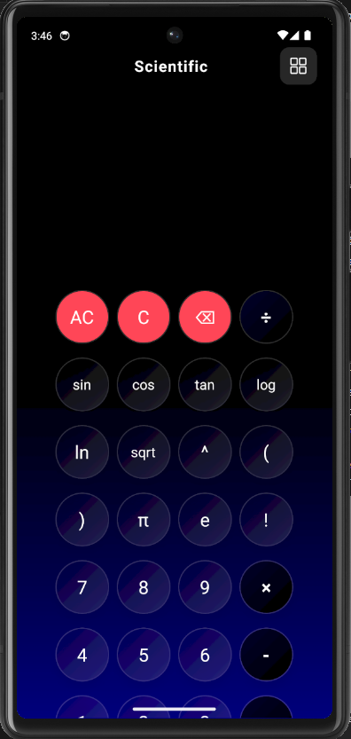

# 🧮 Expo Multi-Calculator App

<div align="center">
  
  
  **A production-ready, feature-rich calculator application built with React Native & Expo**
  
  [](https://reactnative.dev/)
  [](https://expo.dev/)
  [](./LICENSE)
  
</div>

---

## 📱 Features

### 🎯 8 Different Calculator Types

<table>
  <tr>
    <td width="50%">
      <h4>📊 Standard Calculator</h4>
      <p>Basic arithmetic operations with a clean, intuitive interface</p>
      <ul>
        <li>Addition, Subtraction, Multiplication, Division</li>
        <li>Decimal support</li>
        <li>Clear (C), All Clear (AC), Delete (⌫) functions</li>
      </ul>
    </td>
    <td width="50%">
      
    </td>
  </tr>
  <tr>
    <td width="50%">
      <h4>🔬 Scientific Calculator</h4>
      <p>Advanced mathematical functions for complex calculations</p>
      <ul>
        <li>Trigonometric functions (sin, cos, tan)</li>
        <li>Logarithmic functions (log, ln)</li>
        <li>Power, square root, factorials</li>
        <li>Constants (π, e)</li>
      </ul>
    </td>
    <td width="50%">
      
    </td>
  </tr>
  <tr>
    <td width="50%">
      <h4>💰 Financial Calculators</h4>
      <ul>
        <li><strong>GST Calculator</strong>: Calculate GST with CGST/SGST split</li>
        <li><strong>EMI Calculator</strong>: Monthly EMI, Total Interest, Total Payable</li>
        <li><strong>Percentage Calculator</strong>: X% of Y, Percentage increase/decrease</li>
      </ul>
    </td>
    <td width="50%">
      <h4>🏥 Utility Calculators</h4>
      <ul>
        <li><strong>BMI Calculator</strong>: Health category indicators</li>
        <li><strong>Age Calculator</strong>: Calculate age in years, months, days</li>
        <li><strong>Currency Converter</strong>: 8 currencies with static rates</li>
      </ul>
    </td>
  </tr>
</table>

### ✨ Key Highlights

- **🎨 Professional Dark Theme**: Custom gradient (Black → Deep Blue) with glassmorphism effects
- **🌊 Smooth Animations**: Animated splash screen with scale, rotation, and fade effects
- **💫 Glassmorphism UI**: Modern glass-effect buttons with custom shadows and borders
- **⚡ Fully Offline**: No backend required, works completely offline
- **📱 Cross-Platform**: Runs on both Android and iOS
- **🎯 Type Switcher**: Easy navigation between calculator types via bottom sheet modal

---

## 📸 Screenshots

<div align="center">
  
  
</div>

<p align="center"><i>Calculator Type Selection & BMI Calculator</i></p>

---

## 🏗️ Tech Stack

| Technology | Purpose |
|------------|---------|
| **React Native** | Core framework for cross-platform mobile development |
| **Expo SDK 54** | Development platform and build tooling |
| **Expo Linear Gradient** | Professional gradient backgrounds |
| **React Navigation** | Stack-based navigation system |
| **Expo Vector Icons** | Icon library for UI elements |
| **React Native Gesture Handler** | Touch gesture handling |
| **React Native Safe Area Context** | Safe area management |

---

## 📂 Project Structure

```
src/
├── calculators/          # 8 calculator implementations
│   ├── StandardCalculator.js
│   ├── ScientificCalculator.js
│   ├── GstCalculator.js
│   ├── EmiCalculator.js
│   ├── PercentageCalculator.js
│   ├── AgeCalculator.js
│   ├── BmiCalculator.js
│   └── CurrencyCalculator.js
├── components/           # Reusable UI components
│   ├── CalculatorButton.js     # Glassmorphic button component
│   ├── Display.js              # Result display component
│   └── CalculatorTypeModal.js  # Type selection modal
├── navigation/
│   └── AppNavigator.js   # Navigation configuration
├── screens/
│   ├── SplashScreen.js   # Animated splash screen
│   └── HomeScreen.js     # Main calculator screen
├── theme/
│   ├── colors.js         # Color scheme definitions
│   └── gradients.js      # Gradient configurations
└── utils/
    └── calculatorFunctions.js  # Core calculation logic
```

---

## 🚀 Getting Started

### Prerequisites

- Node.js (v14 or higher)
- npm or yarn
- Expo Go app (for testing on physical device)
- Android Studio / Xcode (for emulator)

### Installation

1. **Clone the repository**
   ```bash
   git clone https://github.com/YOUR_USERNAME/expo-calculator-app.git
   cd expo-calculator-app
   ```

2. **Install dependencies**
   ```bash
   npm install
   ```

3. **Start the development server**
   ```bash
   npx expo start
   ```

4. **Run on device/emulator**
   - Scan the QR code with Expo Go (Android/iOS)
   - Press `a` for Android emulator
   - Press `i` for iOS simulator

### Build for Production

```bash
# Android APK
npx expo build:android

# iOS IPA
npx expo build:ios
```

---

## 🎨 Design Philosophy

### Color Scheme
- **Primary Gradient**: `#000000` → `#08007c` (Black to Deep Blue)
- **Accent Color**: `#00012c` (Dark Blue for operators)
- **Glass Effect**: `rgba(3, 0, 31, 0.08)` with white borders

### UI/UX Principles
1. **Minimalism**: Clean interface with focus on functionality
2. **Consistency**: Unified design language across all calculator types
3. **Accessibility**: High contrast colors, large touch targets
4. **Responsiveness**: Optimized for various screen sizes

---

## 🧪 Key Features Implementation

### Glassmorphism Effect
```javascript
glassBackground: 'rgba(3, 0, 31, 0.08)',
glassBorder: 'rgba(255, 255, 255, 0.18)',
shadowOpacity: 0.4,
borderWidth: 1.5
```

### Animated Splash Screen
- Scale animation (0.5 → 1.0)
- Rotation animation (0° → 360°)
- Fade-in effect (opacity 0 → 1)
- Auto-navigation after 2.8 seconds

### Calculation Engine
- Safe expression evaluation with validation
- Support for scientific notation
- Error handling for invalid inputs
- Precision handling for decimal operations

---

## 📊 Calculator Logic Highlights

| Calculator | Key Formula/Logic |
|-----------|-------------------|
| **GST** | `Total = Amount + (Amount × GST% / 100)` |
| **EMI** | `EMI = [P × R × (1+R)^N] / [(1+R)^N - 1]` |
| **BMI** | `BMI = Weight(kg) / Height(m)²` |
| **Age** | Date difference with months/days precision |
| **Currency** | Static exchange rates with USD as base |

---

## 🤝 Contributing

Contributions are welcome! Please follow these steps:

1. Fork the repository
2. Create your feature branch (`git checkout -b feature/AmazingFeature`)
3. Commit your changes (`git commit -m 'Add some AmazingFeature'`)
4. Push to the branch (`git push origin feature/AmazingFeature`)
5. Open a Pull Request

---

## 📄 License

This project is licensed under the MIT License - see the [LICENSE](LICENSE) file for details.

---

## 👨‍💻 Developer

**[RISHI PATHAK]**
- GitHub: [@yourusername](https://github.com/rishifx)
- LinkedIn: [Your LinkedIn](https://linkedin.com/in/rishifx)
- Email: rishi.pathak193@gmail.com

---

## 🙏 Acknowledgments

- Expo team for excellent documentation
- React Native community for valuable resources
- Inspiration from iOS Calculator and Google Calculator

---

<div align="center">
  <strong>⭐ Star this repo if you found it helpful!</strong>
  <br><br>
  Made with ❤️ using React Native & Expo
</div>
